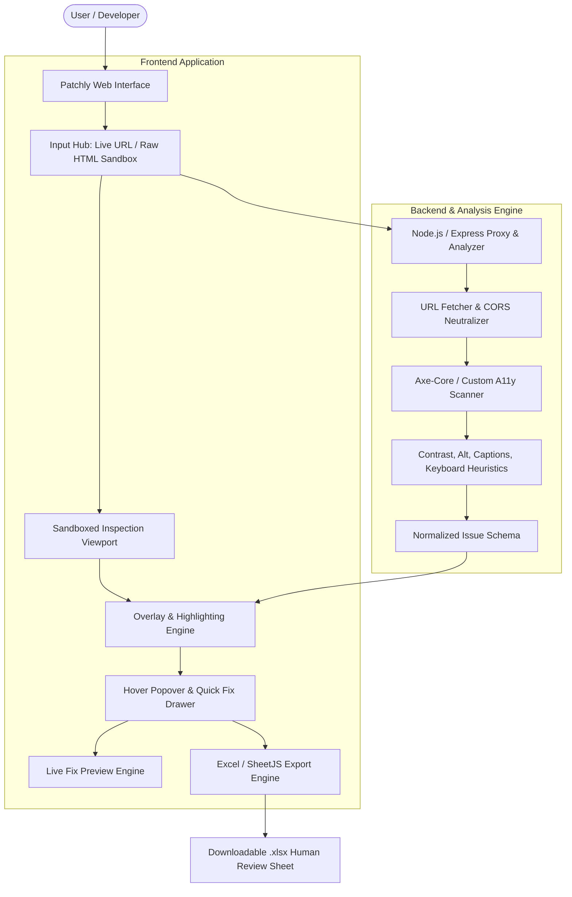

# Patchly - Web Accessibility Scanner & Visual Remediation Platform
## Comprehensive Project Specification & Implementation Plan

---

## 1. Executive Summary & Vision

**Patchly** is an automated, developer-friendly Web Accessibility (a11y) auditing and in-page remediation tool. Instead of presenting overwhelming, disconnected terminal logs or complex technical spreadsheets, Patchly renders live web pages with an **interactive visual overlay** that highlights accessibility violations directly on the page elements.

### Core Objectives:
- **Democratize Accessibility**: Bridge the gap between complex WCAG guidelines (WCAG 2.1/2.2 AA) and practical frontend engineering.
- **In-Context Visual Highlighting**: Pinpoint issues visually on-screen with pulsing indicators and highlights directly above the faulty elements.
- **Actionable Quick Fixes**: Provide copy-pasteable HTML/CSS code patches and one-click fixes for immediate resolution before deployment.
- **Human Assessment Workflow**: For issues that require human editorial judgment (e.g., complex video transcription, intricate ARIA widget behaviors), seamlessly export issues to structured Excel (`.xlsx`) or CSV reports for audit tracking.

---

## 2. Core Functional Requirements & Feature Scope

| ID | Feature | Description | WCAG Criteria / Rules |
| :--- | :--- | :--- | :--- |
| **FR-01** | **Color Contrast Analyzer** | Computes foreground text color against effective background color (including parent backgrounds, gradients, and semi-transparent alphas). Calculates contrast ratio. | WCAG 1.4.3 (Contrast Minimum - AA: 4.5:1 for normal text, 3:1 for large text). |
| **FR-02** | **Image Alt Text Inspector** | Scans ``, `<svg role="img">`, and image buttons. Identifies missing `alt` attributes, empty `alt` on non-decorative images, placeholder text (e.g., "image.png", "photo"). | WCAG 1.1.1 (Non-text Content). |
| **FR-03** | **Video Caption & Subtitle Auditor** | Inspects `<video>` tags to verify presence of valid `<track kind="captions">` or `<track kind="subtitles">`. Flags untracked videos or empty source tracks. | WCAG 1.2.2 (Captions - Prerecorded). |
| **FR-04** | **Keyboard Navigation & Focus Checker** | Audits tab sequence, focus visibility (`outline: none` without replacement), non-interactive elements with click handlers lacking `tabindex`/keyboard handlers, and keyboard focus traps. | WCAG 2.1.1 (Keyboard), WCAG 2.4.7 (Focus Visible), WCAG 2.4.3 (Focus Order). |
| **FR-05** | **Heading & Semantic Structure Audit** | Checks hierarchy (`<h1>` through `<h6>`), skipped levels (e.g. `<h1>` to `<h3>`), missing main landmarks, and form control associations (`<label for="...">`). | WCAG 1.3.1 (Info and Relationships), WCAG 2.4.6 (Headings and Labels). |
| **FR-06** | **Dual Input Modes** | 1. **Live URL Scanner**: Users submit a web URL (processed via proxy to bypass CORS / frame restrictions).<br>2. **Interactive HTML Sandbox / Playground**: Users paste raw HTML/CSS/JS or upload `.html` files for pre-release scanning. | Developer Workflow Enhancement. |
| **FR-07** | **Interactive Visual Overlay ("Flag & Circle")** | Renders live DOM with bounding-box markers, glowing rings, and violation badges pinned over failing nodes. Synchronized with window resize and scroll. | User Experience / Visual Debugging. |
| **FR-08** | **Hover Tooltip & Quick-Fix Drawer** | Hovering or clicking a flag opens a comprehensive inspector card detailing:<br>- WCAG guideline & severity (Critical, Serious, Moderate, Minor).<br>- Root cause explanation in clear plain language.<br>- Exact CSS/HTML code diff displaying the recommended fix. | Developer Productivity. |
| **FR-09** | **Live "Test Fix" Sandbox** | Allows developers to preview the fix in real-time (e.g., updating alt text, boosting contrast, injecting focus outline) directly inside the sandboxed view. | Instant Verification. |
| **FR-10** | **Excel & Data Export for Human Assessment** | One-click export to formatted Excel spreadsheet (`.xlsx`) and JSON/CSV for issues that cannot be resolved automatically (e.g., video captions, semantic descriptions). Contains element selectors, screenshot/bounding coordinates, WCAG guideline, severity, and human reviewer notes column. | Audit & Compliance Management. |

---

## 3. System Architecture & Tech Stack



### Proposed Technology Stack:
1. **Frontend**:
   - Modern Interactive Web Viewport & Overlay UI with Vanilla CSS design tokens.
   - Glassmorphism & sleek dark/light mode UI with responsive design.
   - Floating pinpoint indicators, glowing bounding boxes, and live quick-fix drawers.
2. **Python Backend & Accessibility Inspection Engine**:
   - **Python Core**: FastAPI / Flask web server and automation pipeline.
   - **DOM & AST Parser**: `beautifulsoup4`, `lxml`, and headless browser / DOM inspector for computed styles & coordinates.
   - **Machine Learning / TensorFlow Algorithms**:
     - Image content classifier / alt-text generator (vision model for analyzing images lacking alt text).
     - Color contrast optimization algorithm (mathematical gradient descent / nearest accessible hex search).
     - Keyboard accessibility flow & focus trap sequence predictor.
3. **Export Engine**:
   - **Python `openpyxl` & `pandas`**: Generates styled, multi-column Excel workbooks (`.xlsx`) with severity color coding, issue selectors, and human auditor review workflows.

---

## 4. In-Depth Component Breakdown

### 4.1. Visual Flagging & Overlay Engine
- **Coordinate Computation**: Uses `getBoundingClientRect()` of target elements in the inspected document to project non-intrusive floating badges (`#1`, `#2`, `#3`, ...) and glowing highlight outlines.
- **Category Badge Colors**:
  - 🔴 **Red (Critical/Serious)**: Missing Alt Text on primary images, Keyboard Trap, Severe Color Contrast (< 3:1).
  - 🟠 **Orange (Moderate)**: Borderline Contrast (between 3:1 and 4.5:1), Missing Video Subtitles.
  - 🔵 **Blue (Notice / Best Practice)**: Skipped heading levels, redundant ARIA attributes.
- **Scroll & Viewport Sync**: Dynamic recalculation using `ResizeObserver` and scroll listeners to ensure pins track elements accurately.

### 4.2. Hover & Inspection Card (Quick-Fix Drawer)
- **Problem Statement**: Plain English explanation (e.g. *"This text has a contrast ratio of 2.1:1, which is unreadable for users with low vision or screen glare. Minimum required is 4.5:1."*).
- **Element Context**: CSS selector (`main > div.hero > p.subtext`) and HTML snippet.
- **Remediation Snippet (Before vs After diff)**:
  ```css
  /* Before */
  color: #888888; background-color: #ffffff; /* 2.8:1 FAIL */
  
  /* Suggested Fix */
  color: #595959; background-color: #ffffff; /* 4.6:1 PASS */
  ```
- **Action Buttons**:
  - 📋 *Copy Fix*
  - ⚡ *Apply Fix Temporarily* (Mutates DOM in sandbox to preview resolution)
  - 📥 *Send to Assessment Sheet*

### 4.3. Excel Human Assessment Exporter
When an issue requires human evaluation (e.g., verifying if an image is purely decorative vs informative, writing captions for a video), users can flag it for human assessment. The exported Excel spreadsheet includes:
1. **Issue ID**: Unique identifier (e.g., `ISSUE-001`).
2. **Category**: Contrast, Alt-Text, Captions, Keyboard, Semantic.
3. **Element Selector**: CSS Selector & Tag Name.
4. **Severity**: Critical / High / Medium / Low.
5. **Issue Description**: Detailed failure reason.
6. **Suggested Quick Fix**: Recommended remediation.
7. **Human Action Required**: What the developer/content team must do.
8. **Status Column**: Dropdown-friendly (`Pending Review`, `In Progress`, `Resolved`, `False Positive`).
9. **Reviewer Notes & Timestamp**.

---

## 5. Implementation Roadmap & Phases

### Phase 1: Foundation & Project Scaffolding
- Initialize project structure with modern web stack (Vite + React / Node Express backend).
- Establish unified design system (color tokens, dark/light theme, typography, micro-animations).
- Build the core layout: Navigation, Input Panel (URL input + Sample HTML Switcher), Main Canvas Viewport, and Issue Sidebar.

### Phase 2: Inspection Engine & Rule Checkers
- Integrate `axe-core` and build custom diagnostic modules:
  - Contrast Calculator (WCAG AA & AAA formulas).
  - Media Auditor (Images, SVGs, Videos, Audio).
  - Keyboard Focus Sequence & Interactive Element Validator.
- Standardize issue representation format across all rules.

### Phase 3: Visual Overlay & Interactive Canvas
- Implement the Coordinate Projection Engine mapping issues onto the inspected DOM viewport.
- Build interactive hover cards, animated flag badges, and issue filtering (by severity & category).
- Implement interactive highlight focus (clicking an issue in the sidebar scrolls the viewport to that element).

### Phase 4: Quick-Fix & Remediation System
- Develop rule-specific code diff generators (HTML & CSS).
- Implement the "Simulate Fix" feature (live DOM updates to demonstrate resolved state).
- Create code copying and direct snippet integration.

### Phase 5: Excel Export & Human Assessment Handoff
- Implement SheetJS (`xlsx`) export module with professional styling and human audit templates.
- Add local storage persistence for audit sessions.
- Build sample test pages showcasing accessibility flaws (e.g., contrast failures, missing alt text, keyboard inaccessible modals).

### Phase 6: Testing, Polish & Documentation
- Comprehensive manual and automated verification against standard accessibility test suites.
- Performance optimization for large DOMs.
- Detailed user guide and developer documentation.

---

## 6. Success Metrics & Verification Plan
- **Detection Accuracy**: Correctly identifies 100% of standard WCAG 2.1 AA violations on test fixtures.
- **Overlay Reliability**: Highlights stay accurately aligned across desktop, tablet, and mobile viewports.
- **Fix Viability**: Suggested quick-fixes pass WCAG rules upon re-testing.
- **User Experience**: Sub-2-second scan time for typical web pages; smooth, glitch-free UI with high aesthetic appeal.
